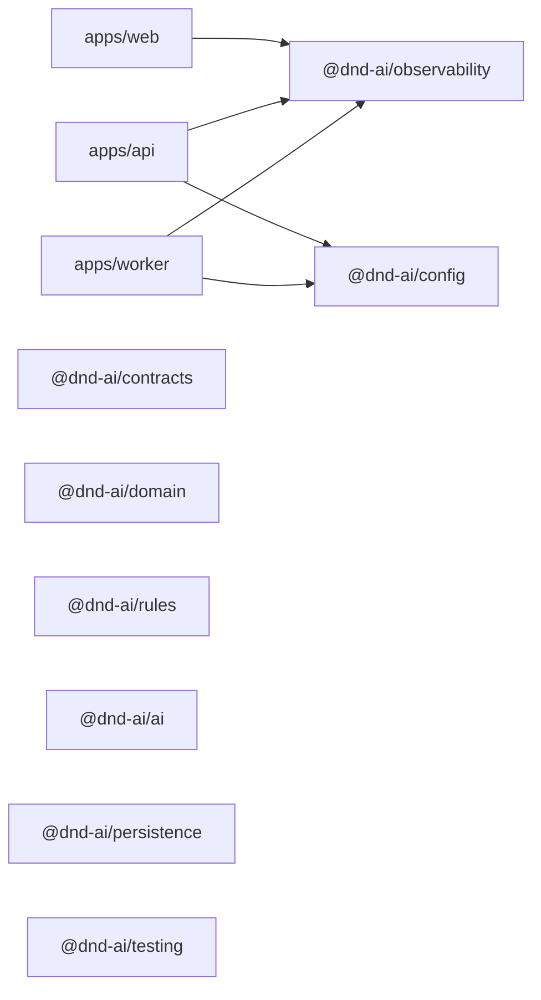
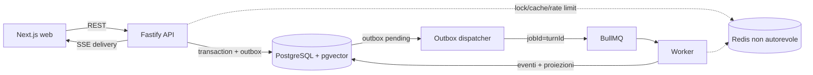

# System overview

## Legenda di stato

- **Implementato**: verificabile nel repository e nei test citati.
- **Pianificato**: requisito normativo posseduto da un task non concluso.

La legenda vale per ogni sezione: la presenza di un workspace o di un contratto di fondazione non implica che la relativa feature di gioco sia già disponibile.

## Inventario implementato

| Path | Package name | Responsabilità corrente |
|---|---|---|
| `apps/web` | `@dnd-ai/web` | Next.js App Router, instrumentation e health route reale; la shell di gioco è pianificata in `BL-079`. |
| `apps/api` | `@dnd-ai/api` | Composition root Fastify, configurazione fail-fast e osservabilità; nessuna API di dominio è ancora esposta. |
| `apps/worker` | `@dnd-ai/worker` | Composition root worker, configurazione fail-fast e osservabilità; non è ancora un consumer BullMQ. |
| `packages/ai` | `@dnd-ai/ai` | Confine package per porte e adapter AI; oggi contiene soltanto la fondazione tipizzata. |
| `packages/config` | `@dnd-ai/config` | Parser Zod server-only e profili runtime per API, worker e migration. |
| `packages/contracts` | `@dnd-ai/contracts` | Schemi Zod strict e artefatti JSON Schema/OpenAPI versionati. |
| `packages/domain` | `@dnd-ai/domain` | Confine puro per entità, comandi, porte e invarianti; il dominio di gioco arriva nei task proprietari. |
| `packages/observability` | `@dnd-ai/observability` | Correlation context, tracing OTel, logging redatto e Sentry error-only. |
| `packages/persistence` | `@dnd-ai/persistence` | Runner migration, manifest e feature flag store PostgreSQL. |
| `packages/rules` | `@dnd-ai/rules` | Confine puro del Rules Engine; le regole di gioco arrivano nei task proprietari. |
| `packages/testing` | `@dnd-ai/testing` | Primitive deterministiche e lifecycle Node per PostgreSQL/Redis di test. |

## Dipendenze implementate

Il grafo mostra soltanto dipendenze **workspace→workspace** dichiarate nei manifest correnti. I nodi senza archi sono leaf o fondazioni non ancora collegate; non rappresentano dipendenze future.

App→app, package→app, import relativi fuori package e cicli workspace sono vietati. Il contratto è applicato da `scripts/lib/workspace-boundaries.mjs` e dal test `workspace-boundaries`.

## Flusso target pianificato

Il flusso seguente è la topologia normativa della vertical slice, non lo stato del runtime corrente. L'outbox evita di trattare database e queue come una singola transazione distribuita; Redis migliora il coordinamento ma non sostituisce i vincoli PostgreSQL.

Il contratto completo e le condizioni di revisione sono in [`ADR-0009`](../adr/0009-mvp-runtime-data-and-workflow-architecture.md).

## Capability non ancora disponibili

- **BullMQ:** Pianificato
- **Redis locale:** Pianificato
- **API di dominio:** Pianificata
- **Staging:** non disponibile

I task proprietari sono rispettivamente `BL-030`, `BL-029`, `BL-028`/`BL-038` e `BL-080`. Lo stato bloccato di `BL-080` non autorizza deploy, release, Production o modifiche all'account Vercel.

## Fondazioni implementate

| Area | Stato verificabile | Documento proprietario |
|---|---|---|
| Configurazione | `runtime-config-v1`, profili service-scoped, errori redatti e startup fail-fast | [`CONFIGURATION.md`](../operations/CONFIGURATION.md), [`ADR-0004`](../adr/0004-runtime-configuration-and-secret-injection.md) |
| Migrazioni | PostgreSQL 17 + pgvector, ledger applicativo, head `000002_feature_flags` | [`DATABASE_MIGRATIONS.md`](../operations/DATABASE_MIGRATIONS.md), [`ADR-0006`](../adr/0006-postgresql-migration-foundation.md) |
| Feature flag | Catalogo kill switch server-side, default safe e audit append-only | [`BL-010 design`](../superpowers/specs/2026-07-15-bl-010-feature-flags-design.md) |
| Contratti | Zod-first `api-contract-v1`, JSON Schema/OpenAPI generati e drift check | [`docs/api/README.md`](../api/README.md), [`ADR-0008`](../adr/0008-zod-first-contract-generation.md) |
| Osservabilità | Correlation context, tracing in-memory, Pino redatto e Sentry error-only | [`BL-008 design`](../superpowers/specs/2026-07-15-bl-008-observability-baseline-design.md), [`ADR-0007`](../adr/0007-observability-context-and-error-reporting.md) |
| Testing | Runner Node, fixture deterministiche, lifecycle PostgreSQL/Redis e artifact verificati | [`TEST_STRATEGY.md`](../testing/TEST_STRATEGY.md) |
| CI e supply chain | Quality, test, security, build/artifact e `CI / Merge gate` fail-closed | [`CI_CD.md`](../operations/CI_CD.md), [`ADR-0003`](../adr/0003-ci-trust-boundary-and-artifacts.md) |
| Frontend | Pagina Next.js minima e `/health`; nessuna shell di gioco ancora implementata | [`UX_UI_DESIGN.md`](../product/UX_UI_DESIGN.md), [`ADR-0001`](../adr/0001-mobile-first-conversational-ui.md) |

## Confini operativi correnti

- Il web è l'unico runtime con una health route applicativa reale: `GET /health`.
- API e worker provano il bootstrap e la configurazione, ma non offrono ancora un percorso di gioco end-to-end.
- Le migration e i test database usano PostgreSQL locale/effimero; Redis è disponibile soltanto nel test harness di `QA-001`, non come servizio locale dell'applicazione.
- Lo staging non esiste. Le procedure Vercel rimangono fail-closed nel runbook [`PREVIEW_STAGING.md`](../operations/PREVIEW_STAGING.md); `BL-080` resta bloccato e fuori dallo scope di `DOC-ARCH-001`.
