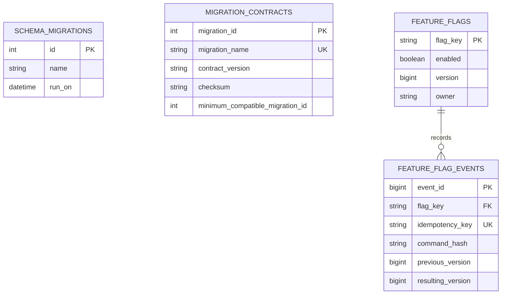
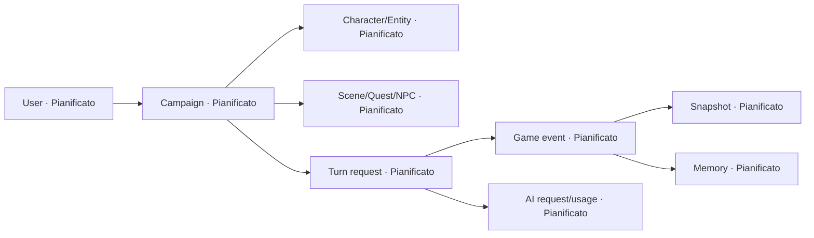

# Modello dati

## Legenda

- **Implementato**: schema creato dalle migration condivise e verificabile sul migration head corrente.
- **Pianificato**: modello normativo senza migration fisica corrente; nomi e relazioni non sono ancora un contratto SQL.

## Contratto fisico implementato

| Elemento | Valore corrente | Fonte |
|---|---|---|
| PostgreSQL | `17` | `infra/local/postgres.compose.yml` |
| pgvector | `0.8.2` | immagine Compose pin a digest |
| Migration runner | `node-pg-migrate 8.0.4` | `packages/persistence/package.json` |
| Migration head | `000002_feature_flags` | `DATABASE_MIGRATION_HEAD` |
| Contract attivo | `database-feature-flags-v1` | `DATABASE_CONTRACT_VERSION` |
| Compatibilità minima | migration `000001_postgresql_foundation` | manifest versionato |

Le migration sono eseguite in ordine, sotto advisory lock, con singola transazione per run. Il runner rifiuta file sconosciuti, ledger non ordinati, contract/checksum inattesi e oggetti di fondazione presenti senza migration applicata.

## Schema e tabelle implementate

### Estensione e namespace

- L'estensione `vector` è installata dalla prima migration. Non esistono ancora colonne embedding o indici vettoriali applicativi.
- Lo schema `infra` contiene il ledger gestito dal runner e il contratto applicativo delle migration.
- Lo schema `app` contiene soltanto feature flag e relativo audit. Non contiene ancora utenti, campagne, turni o stato di gioco.

### `infra.schema_migrations`

Tabella gestita da `node-pg-migrate`, con `id` serial primary key, `name` `varchar(255) NOT NULL` e `run_on` `timestamp NOT NULL`. L'applicazione legge le righe per ordine di esecuzione e richiede che coincidano con il prefisso noto del manifest; non viene attribuito al database un vincolo unique su `name` che la libreria non crea.

### `infra.migration_contracts`

| Campo | Vincoli effettivi |
|---|---|
| `migration_id` | integer, primary key, maggiore di zero |
| `migration_name` | text non vuoto, unique |
| `contract_version` | text non vuoto |
| `checksum` | text nel formato SHA-256 lowercase |
| `minimum_compatible_migration_id` | positivo e non maggiore di `migration_id` |
| `applied_at` | timestamptz, default current timestamp |
| `superseded_at` | timestamptz nullable, non precedente ad `applied_at` |

L'indice parziale unique `migration_contracts_one_active_idx` ammette un solo contratto con `superseded_at IS NULL`.

### `app.feature_flags`

| Campo | Vincoli effettivi |
|---|---|
| `flag_key` | text, primary key, formato dot-separated lowercase |
| `enabled` | boolean non nullo, default `false` |
| `default_enabled` | boolean non nullo e sempre `false` |
| `version` | bigint non negativo, default `0` |
| `owner` | text nel formato owner allowlisted |
| `updated_by` | actor ID non vuoto e bounded, default `system:migration` |
| `updated_reason_code` | reason code lowercase, default `operator_request` |
| `updated_at` | timestamptz, default current timestamp |

La migration inserisce esclusivamente le chiavi chiuse `campaign.start`, `turn.new` e `model.route.premium`, tutte disabilitate.

### `app.feature_flag_events`

| Campo | Vincoli effettivi |
|---|---|
| `event_id` | bigint identity, primary key |
| `flag_key` | foreign key verso `app.feature_flags(flag_key)`, delete restrict |
| `idempotency_key` | text bounded, unique |
| `command_hash` | SHA-256 lowercase |
| `previous_version` | bigint non negativo |
| `resulting_version` | esattamente `previous_version + 1` |
| `enabled` | boolean non nullo |
| `actor_id`, `reason_code`, `correlation_id` | text non vuoto con formato bounded |
| `created_at` | timestamptz, default current timestamp |

L'indice `feature_flag_events_flag_key_created_at_idx` ordina la lettura audit per `(flag_key, created_at, event_id)`. Gli eventi di flag sono append-only per contratto applicativo; la baseline non attribuisce loro i futuri vincoli del log di gioco.

## Relazioni implementate

`SCHEMA_MIGRATIONS` e `MIGRATION_CONTRACTS` descrivono due viste complementari dello stesso avanzamento, ma non hanno una foreign key fisica fra loro.

## Modello logico pianificato

Questo diagramma è concettuale. Ogni nodo è **Pianificato** e non autorizza query, tabelle o migration con questi nomi. Il sotto-modello identity è invece nominato dal design approvato `identity-signup-v1`, ma resta pianificato finché `BL-005` non integra e verifica la migration `000003_identity_signup`.

### Identity signup pianificata

ADR-0010 e il design BL-005 approvano come target `users`, `user_credentials`, `email_verification_challenges`, `user_sessions`, `identity_email_outbox`, `identity_rate_limits`, `identity_idempotency` e `identity_audit_events`. Le invarianti normative sono: email normalizzata univoca; utente pending fino alla verifica; challenge one-time con scadenza/tentativi/supersession; token sessione e codice conservati soltanto come digest; audit append-only; signup+outbox e challenge consumption+attivazione atomici. Nessuna di queste tabelle è ancora implementata sul migration head `000002_feature_flags`.

## Ownership dei task

| Area concettuale | Task proprietario | Regola per la migration futura |
|---|---|---|
| Utente, verifica, sessione e ownership | `BL-005`–`BL-007` | `BL-005` possiede `000003_identity_signup`, constraint, concorrenza e test negativi; `BL-006` estende il lifecycle senza riscrivere la migration condivisa. |
| Personaggio e cataloghi | `BL-011`, `BL-015`–`BL-017` | Nessuna tabella è nominata in anticipo; aggregate e autosave definiscono il contratto. |
| Campagna, Bible, scena, location, quest e clock | `BL-018`, `BL-022`–`BL-025` | Persistenza soltanto dopo schema e validazione della Bible. |
| NPC e knowledge state | `BL-025`, `BL-052`, `BL-053` | Knowledge boundary e ownership precedono qualsiasi indice di retrieval. |
| Turn request, idempotenza e queue handoff | `BL-028`–`BL-030` | Unique/partial index e outbox vengono introdotti con test concorrenti e retry. |
| Event log canonico | `BL-036` | Evento, sequence, causation e proiezione sono atomici. |
| Snapshot e replay | `BL-037` | Checksum e convergenza sono obbligatori prima dell'adozione. |
| Memoria episodica e pgvector | `BL-054`–`BL-057` | Filtri di visibilità precedono ranking e indice vettoriale. |
| AI request, tool call e usage/costo | `BL-021`, `BL-034`, `BL-064` | Payload e retention devono restare redatti e versionati. |

## Regole di aggiornamento

Ogni nuova migration deve aggiornare nello stesso change set: migration head e contract version, manifest/checksum, tabelle/vincoli/indici di questa pagina, diagramma fisico, task proprietario, test database e note operative. Un modello pianificato passa a **Implementato** soltanto dopo una migration condivisa e verificata; non si deduce lo schema fisico dalla sola specifica.
