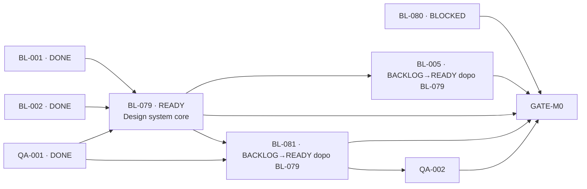

# GOV-004 — Sblocco locale della fondazione UX/UI

## Stato e approvazione

Design approvato dal Product Owner il 2026-07-16. La decisione non autorizza deploy, release, Production o modifiche al progetto Vercel; `BL-080` resta congelato e bloccato alle condizioni già registrate.

## Problema

`BL-079` dipende oggi da `BL-080` perché include uno smoke della shell su preview/staging. Il vincolo remoto blocca però lavoro interamente locale: design tokens, primitive shadcn/ui, layout statico, componenti conversazionali, accessibilità di base e fixture deterministiche.

La card `BL-079` comprende inoltre due risultati separatamente verificabili:

1. la fondazione visuale consumata da identity e form;
2. la shell conversazionale consumata dal loop di gioco.

Finché rimangono uniti, identity e tutti gli altri consumer UI attendono anche drawer, motion, stati conversazionali e smoke remoto. Questo amplia il tempo di ciclo senza proteggere un confine tecnico reale.

## Approcci considerati

### A. Sblocco local-first e decomposizione per consumer — scelto

Rimuovere `BL-080` dalle dipendenze di `BL-079`, ridurre `BL-079` alla fondazione visuale con una shell statica dimostrativa e creare `BL-081` per la shell conversazionale interattiva. Lo smoke remoto resta in `BL-080`/`GATE-M0`; `QA-002` consolida il browser harness dopo `BL-081`.

Vantaggi: sblocca subito un task piccolo, rende identity indipendente dal provider e conserva un owner preciso per shell e test browser. Costo: una nuova card e una matrice dipendenze più esplicita.

### B. Solo rimozione di `BL-080`

Mantenere l'intero scope attuale di `BL-079`, cambiando soltanto il gate remoto in locale/CI. Riduce il churn documentale ma lascia una card ampia che continua a bloccare identity fino al completamento di shell, motion e failure state.

### C. Identity backend-only

Lasciare `BL-079` bloccato e separare il backend di `BL-005` dalle schermate. Produce codice backend prima, ma rinvia la vertical slice verificabile e moltiplica task di ricomposizione per signup, verifica e accessibilità.

## Decisione

Adottare l'approccio A con tre confini.

### GOV-004 — riallineamento del grafo

Task `FAST`, solo documentazione e metadata. Aggiorna nello stesso change set:

- `docs/MVP_SPEC.md` e `docs/TASKS.md`;
- ADR-0001 e studio UX/UI;
- `docs/CONTEXT.md`, `docs/TRACEABILITY.md` e `docs/CHANGELOG.md`;
- test documentali/task graph soltanto se serve una nuova regressione anti-drift.

Il task è concluso quando `BL-079` risulta il primo P0 `READY`, il grafo è aciclico e nessun criterio locale richiede staging.

### BL-079 — design system core e shell statica

Stima `S`, dipendenze `BL-001`, `BL-002`, `QA-001`. Deliverable:

- shadcn/ui `new-york` su base Radix e `components.json` canonico;
- Tailwind e PostCSS minimi per l'app web;
- token semantici dark-first, compatibili con un futuro tema light;
- Geist Sans/Mono, Lucide, radius, spacing, focus e touch target;
- primitive source-owned minime per i consumer immediati: button, field/input, textarea, alert e separator o equivalenti verificati tramite la skill shadcn;
- una shell statica mobile-first sulla pagina corrente che dimostri gerarchia, densità, tipografia e composer senza fingere backend o stato canonico;
- contract test, build e verifica visuale locale sui breakpoint essenziali.

Fuori scope: AI Elements, drawer interattivi, state machine del turno, Motion coordinato, Rive, API, auth e provider. Nessuna dipendenza Vercel.

Al completamento di `BL-079`, `BL-005` e `BL-081` diventano candidati `READY`; l'ordine canonico del backlog seleziona prima `BL-005`.

### BL-081 — shell conversazionale interattiva

Stima `M`, dipendenze `BL-079`, `QA-001`. Deliverable:

- primitive AI Elements installate selettivamente e adattate ai contratti di dominio;
- wrapper `GameConversation`, `NarrativeTurn`, `FreeActionComposer` e `GameDrawer`;
- fixture deterministiche per idle, submitting, progress, completed, reconnect ed errori;
- layout mobile 320–430 px e progressive enhancement desktop;
- Motion con `LazyMotion` e reduced-motion; Rive assente dal bundle iniziale salvo benchmark successivo;
- browser/component smoke locale minimo per focus, touch target, overflow e stato equivalente senza motion.

Fuori scope: REST/SSE reali, mutazioni ottimistiche, provider AI, staging e visual harness condiviso.

### QA-002 — consolidamento browser

Le dipendenze diventano `QA-001`, `BL-081`. Il task mantiene:

- lifecycle server/browser comune;
- viewport 320/390/1440 e touch;
- keyboard, zoom, safe area e reduced-motion;
- accessibility scan e fixture negativa;
- visual regression e artifact deterministici;
- failure path di server, browser e snapshot drift.

Non duplica le fixture di `BL-081` e non richiede Vercel.

## Matrice dei consumer

| Consumer | Dipendenza diretta | Motivo |
|---|---|---|
| `BL-005`, `BL-006` | `BL-079` | form identity e feedback accessibile consumano token e primitive, non la shell di gioco |
| `BL-012`, `BL-013`, `BL-014`, `BL-016`, `BL-017`, `BL-019` | `BL-079` | builder/form condividono la fondazione visuale |
| `BL-027`, `BL-039`, `BL-040`, `BL-071`, `BL-072` | `BL-079`, `BL-081` | progress, recovery e loop di gioco consumano anche il modello conversazionale |
| `QA-002` | `QA-001`, `BL-081` | consolida il browser harness dopo la feature reale |
| `GATE-M0` | include `BL-079`, `BL-080`, `BL-081`, `QA-002` | integra fondazione, shell, ambiente remoto e gate browser senza dipendenze circolari |

Ogni task che crea una superficie utente continua a citare direttamente `BL-079`, lo studio UX/UI e ADR-0001. La dipendenza aggiuntiva da `BL-081` è richiesta soltanto ai consumer della conversazione di gioco.

## Confine dello smoke remoto

Lo smoke locale/CI prova che l'app si costruisce, si avvia e rende le fixture sui breakpoint previsti. Lo smoke remoto prova invece provisioning, deployment identity, origin, regione, configurazione e rollback: resta quindi responsabilità di `BL-080` e del gate integrato M0.

Una feature locale può essere `DONE` senza staging quando:

- non modifica un percorso remoto già disponibile;
- build, runtime locale e browser smoke applicabili sono verdi;
- il criterio remoto è assegnato esplicitamente a `BL-080`/`GATE-M0`;
- la delivery GitHub protetta resta verde.

Questa regola non trasforma un test locale in evidenza provider e non indebolisce il blocco Vercel.

## Stato e flusso dopo GOV-004

Subito dopo la delivery di `GOV-004`, il solo nuovo task `READY` è `BL-079`. Dopo la sua delivery, la selezione standard sceglie `BL-005` perché compare prima di `BL-081` nel backlog P0.

## Test e criteri di accettazione GOV-004

- `pnpm verify:docs` passa con metadata, link, ADR, Mermaid, secret scan e task graph;
- `MVP_SPEC`, card, ADR-0001 e studio UX/UI descrivono la stessa decomposizione;
- `BL-079` non dipende da `BL-080` e non contiene smoke staging;
- `BL-081` possiede shell interattiva, Motion e browser smoke locale minimo;
- `QA-002` dipende da `BL-081` e conserva il visual/accessibility harness;
- `GATE-M0` continua a dipendere da `BL-080` e possiede l'integrazione remota;
- nessun file Vercel, workflow deploy, binding o configurazione provider cambia;
- nessun task oltre `BL-079` viene marcato prematuramente `READY`.

## Rischi e mitigazioni

| Rischio | Mitigazione |
|---|---|
| Fondazione troppo povera per identity | BL-079 include le primitive form/accessibilità richieste da `BL-005` |
| Shell statica scambiata per gioco funzionante | fixture e copy non dichiarano backend, streaming o stato canonico disponibili |
| Duplice ownership dei test browser | BL-081 possiede smoke minimo di feature; QA-002 consolida harness, visual e failure path |
| Consumer di gioco dipende soltanto dai token | task conversazionali ricevono dipendenza diretta aggiuntiva da `BL-081` |
| Lo sblocco aggira staging | `BL-080` resta bloccato e `GATE-M0` continua a richiedere evidenza remota |
| Nuovi task rallentano l'agente | un solo task di governo FAST e change set funzionali più piccoli, ognuno con un unico owner e gate proporzionato |

## Non-obiettivi

- risolvere il first deployment Vercel;
- cambiare account, piano Hobby, repository GitHub o branch Production;
- implementare ora shadcn/ui o la shell;
- cambiare REST/SSE, `TurnView` o state machine;
- anticipare auth, database utenti o provider AI;
- rendere `READY` task con altre dipendenze incomplete.
